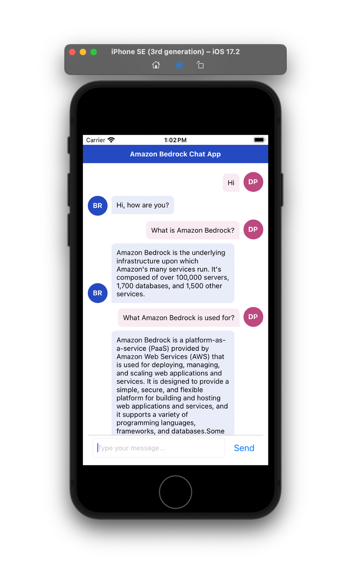
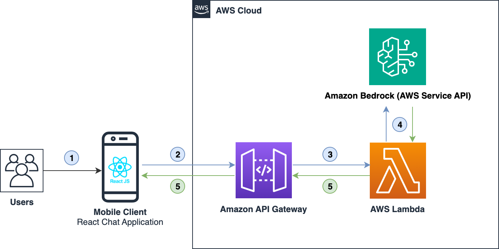

# Add Amazon Bedrock Chat Capabilities to a React Native App

The [Add Amazon Bedrock Chat Capabilities to a React Native App](https://aws-preview.aka.amazon.com/blogs/mobile/integrating-amazon-bedrock-chat-capabilities-in-react-native/) blog post will guide you through creating a simple mobile chat application. The application uses Amazon Bedrock to generate AI-powered chat features and enhance user experiences.

# Architecture Diagram

Flow of a mobile chat application using AWS services.

1. Users access the application from their mobile devices.
2. The mobile client React chat application interfaces with Amazon API Gateway.
3. Amazon API Gateway interacts with AWS Lambda to post and fetch the data.
4. AWS Lambda interacts with one of the Amazon Bedrock AI models and returns the generated response in a JSON format.
5. The processed data is then returned to the frontend for display, facilitating content or chat presentation.

## Security

See [CONTRIBUTING](CONTRIBUTING.md#security-issue-notifications) for more information.

## License

This library is licensed under the MIT-0 License. See the LICENSE file.

